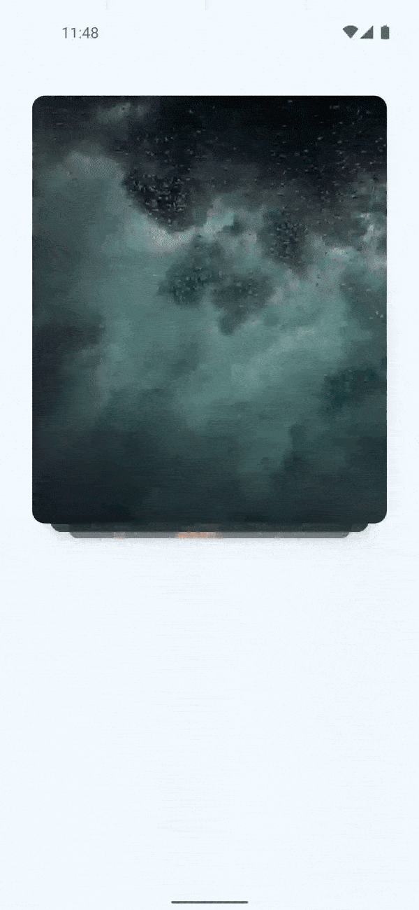
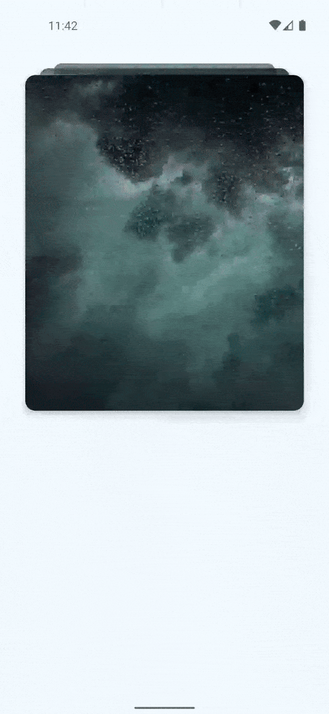

<h1 align="center">StackCarousel</h1>

<p align="center">
  <a href="https://opensource.org/licenses/Apache-2.0"></a>
  </a>
  </a>
  </a>

**StackCarousel** is a highly customizable and versatile carousel library built using Jetpack
Compose, designed to provide a smooth and engaging user experience in Android applications. This
library allows developers to create stack-based carousels with various configurations and
animations, making it easy to integrate into any Jetpack Compose project.

## Key Features

- **Stack Type Customization:**
    - **Top:** Arrange items in the carousel with the stack positioned at the top, creating a
      descending visual effect as users swipe through the items.
    - **Bottom:** Position the stack at the bottom, with items appearing to rise as they are swiped.
      This option provides a different visual dynamic and interaction style.

- **Swipe Type Customization:**
    - **Rotate:** Apply a rotational effect as users swipe through the carousel.
    - **Scale:** Implement a scaling effect where items large to small.
    - **Default:** Use the standard swipe behavior without additional effects, for a classic
      carousel experience.

- **Animation Control:**
    - **Enable/Disable Animations:** Easily toggle animations on or off based on the application’s
      requirements, optimizing performance where necessary.


## Preview

<p align="center">

</p>

## Adding the library to your project✨

Add the followings to your project level `build.gradle` file.

```groovy
dependencies {
    implementation 'com.github.JaberAhamed:StackCarouselCompose:1.0.2'
}
```

Add the following to your **root** `build.gradle` file:

```gradle
allprojects {
	repositories {
		maven { url = 'https://jitpack.io' }
	}
}
```

### Requirements

**1.** Minimum SDK for this library is **API 24**.

## Usage

## Static Carousel
It's a static carousel there is not animation and not swipe effect.

```
// list of images
val images =
    listOf(...)

// state of carousel
val carouselState = rememberCarouselState(totalPageCount = images.size)

StackCarousel(
    modifier =
    Modifier.padding(
        start = 30.dp,
        end = 30.dp
    ),
    state = carouselState,
    isEnableAnimation = false,
    items = images
) { page: Int ->

    Image(
        painter = painterResource(id = page),
        modifier =
        Modifier
            .height(400.dp)
            .fillMaxWidth(),
        contentDescription = "",
        contentScale = ContentScale.Crop
    )
```

## Scale StackCarousel

## Preview of Scale StackCarousel
It's a scale **StackCarousel** there is animation enable is true and also able to scale effect when
swipe the content.

<p align="center">

</p>

```
// list of images
val images =
    listOf(...)

// state of carousel
val carouselState = rememberCarouselState(totalPageCount = images.size)

StackCarousel(
        modifier =
        Modifier.padding(
            start = 30.dp,
            end = 30.dp
        ),
        state = carouselState,
        isEnableAnimation = true,
        swipeType = SwipeType.Scale,
        items = images
) { page: Int ->

        Image(
            painter = painterResource(id = page),
            modifier =
            Modifier
                .height(400.dp)
                .fillMaxWidth(),
            contentDescription = "",
            contentScale = ContentScale.Crop
        )
    }
```

## Rotate StackCarousel
It's a rotate **StackCarousel** there is animation enable is true and also able to rotate effect
when swipe the content.

## Preview of Rotate StackCarousel

<p align="center">

</p>


```
// list of images
val images =
    listOf(...)

// state of carousel
val carouselState = rememberCarouselState(totalPageCount = images.size)

StackCarousel(
        modifier =
        Modifier.padding(
            start = 30.dp,
            end = 30.dp
        ),
        state = carouselState,
        isEnableAnimation = true,
        swipeType = SwipeType.Rotate,
        items = images
) { page: Int ->

        Image(
            painter = painterResource(id = page),
            modifier =
            Modifier
                .height(400.dp)
                .fillMaxWidth(),
            contentDescription = "",
            contentScale = ContentScale.Crop
        )
    }
```

## Top StackCarousel
It's a top **StackCarousel** there is animation enable is true and also able to top effect when
swipe the content.

## Preview Top StackCarousel
<p align="center">

</p>


```
// list of images
val images =
    listOf(...)

// state of carousel
val carouselState = rememberCarouselState(totalPageCount = images.size)

StackCarousel(
        modifier =
        Modifier.padding(
            start = 30.dp,
            end = 30.dp
        ),
        state = carouselState,
        isEnableAnimation = true,
        stackType = StackType.Top,
        items = images
) { page: Int ->

        Image(
            painter = painterResource(id = page),
            modifier =
            Modifier
                .height(400.dp)
                .fillMaxWidth(),
            contentDescription = "",
            contentScale = ContentScale.Crop
        )
    }
```

## Find this library useful? ❤️

Give a ⭐️ if this project helped you!

## License

```
Copyright 2024 JABER BIN AHAMED

Licensed under the Apache License, Version 2.0 (the "License");
you may not use this file except in compliance with the License.
You may obtain a copy of the License at

    http://www.apache.org/licenses/LICENSE-2.0

Unless required by applicable law or agreed to in writing, software
distributed under the License is distributed on an "AS IS" BASIS,
WITHOUT WARRANTIES OR CONDITIONS OF ANY KIND, either express or implied.
See the License for the specific language governing permissions and
limitations under the License.
```